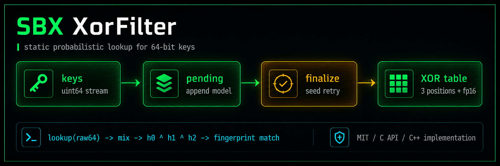

<div align="center">

# SBX XorFilter

Compact static XOR filter for high-throughput 64-bit lookups.


[Русская версия](README.ru.md)

</div>



## What It Is

SBX XorFilter is a small project-owned static XOR filter implementation used for
compact probabilistic membership checks over 64-bit keys.

It is designed for workloads where lookup speed and predictable memory layout
matter more than dynamic updates. The filter is built once, finalized, and then
queried many times.

## Design

- 16-bit fingerprints.
- 3 hash positions per key.
- Append-then-finalize build model.
- Deterministic seed retry during construction.
- Fast lookup path for already prepared 64-bit keys.
- Optional reusable scratch memory for repeated filter builds.
- No external runtime dependencies.

## Build

```bash
make
```

This builds:

```text
libsbx-xorfilter.a
```

Manual build:

```bash
g++ -O3 -std=c++11 -c xorfilter.cpp -o xorfilter.o
gcc -O3 -c sbx_hash64.c -o sbx_hash64.o
ar rcs libsbx-xorfilter.a xorfilter.o sbx_hash64.o
```

When linking a final executable, prefer `g++` because the implementation is
C++11 with a C-compatible API.

## Public API

```c
int xorfilter_init2(struct xorfilter *filter, uint64_t entries, long double error);
int xorfilter_init(struct xorfilter *filter, uint64_t entries, long double error);
int xorfilter_add(struct xorfilter *filter, const void *buffer, int len);
int xorfilter_finalize(struct xorfilter *filter);
int xorfilter_finalize_with_scratch(struct xorfilter *filter, struct xorfilter_scratch *scratch);
int xorfilter_check(struct xorfilter *filter, const void *buffer, int len);
int xorfilter_check_hash_fast(const struct xorfilter *filter, uint64_t raw);
static inline int xorfilter_check_hash_inline(const struct xorfilter *filter, uint64_t raw);
void xorfilter_scratch_free(struct xorfilter_scratch *scratch);
void xorfilter_free(struct xorfilter *filter);
```

## Minimal Example

```c
#include "xorfilter.h"

#include <stdint.h>
#include <stdio.h>

int main(void) {
  struct xorfilter filter;
  uint64_t key = 0x123456789abcdef0ULL;

  if (xorfilter_init2(&filter, 1, 0.0001L) != 0) {
    return 1;
  }

  xorfilter_add(&filter, &key, sizeof(key));
  xorfilter_finalize(&filter);

  if (xorfilter_check(&filter, &key, sizeof(key))) {
    puts("maybe present");
  }

  xorfilter_free(&filter);
  return 0;
}
```

## Hot Lookup Path

For very hot loops, use the raw 64-bit lookup path when the caller already has a
prepared key:

```c
int hit = xorfilter_check_hash_fast(&filter, raw64);
```

For header-only inlining inside C/C++ hot code:

```c
int hit = xorfilter_check_hash_inline(&filter, raw64);
```

## Limits

- Static filter: no delete operation.
- Probabilistic membership: false positives are possible.
- Intended for lookup-heavy workloads after finalization.

## Donate

If SBX XorFilter is useful to your work, you can support the project here:

- Bitcoin (BTC): `1ECDSA1b4d5TcZHtqNpcxmY8pBH1GgHntN`
- USDT (TRC20): `TUF4vPdB6QkjCvZq18rBL4Qj4dK5ihCN75`

## License

MIT License. See [LICENSE](LICENSE).
