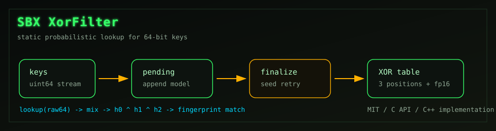

<div align="center">

# SBX XorFilter

Компактный статический XOR-фильтр для быстрых проверок 64-битных ключей.


[English version](README.md)

</div>



## Что Это

SBX XorFilter - небольшая собственная реализация статического XOR-фильтра для
компактных вероятностных проверок принадлежности 64-битных ключей.

Фильтр рассчитан на задачи, где важны скорость lookup-проверки и предсказуемая
память. Данные добавляются, фильтр финализируется, после этого он быстро
проверяет ключи.

## Устройство

- 16-битные отпечатки.
- 3 hash-позиции на ключ.
- Модель построения `add -> finalize`.
- Детерминированный подбор seed при построении.
- Быстрый путь lookup для уже подготовленных 64-битных ключей.
- Опциональный reusable scratch для повторного построения фильтров.
- Без внешних runtime-зависимостей.

## Сборка

```bash
make
```

Будет собрана статическая библиотека:

```text
libsbx-xorfilter.a
```

Ручная сборка:

```bash
g++ -O3 -std=c++11 -c xorfilter.cpp -o xorfilter.o
gcc -O3 -c sbx_hash64.c -o sbx_hash64.o
ar rcs libsbx-xorfilter.a xorfilter.o sbx_hash64.o
```

Финальный исполняемый файл лучше линковать через `g++`, потому что реализация
на C++11, а наружу отдается C-compatible API.

## Public API

```c
int xorfilter_init2(struct xorfilter *filter, uint64_t entries, long double error);
int xorfilter_init(struct xorfilter *filter, uint64_t entries, long double error);
int xorfilter_add(struct xorfilter *filter, const void *buffer, int len);
int xorfilter_finalize(struct xorfilter *filter);
int xorfilter_finalize_with_scratch(struct xorfilter *filter, struct xorfilter_scratch *scratch);
int xorfilter_check(struct xorfilter *filter, const void *buffer, int len);
int xorfilter_check_hash_fast(const struct xorfilter *filter, uint64_t raw);
static inline int xorfilter_check_hash_inline(const struct xorfilter *filter, uint64_t raw);
void xorfilter_scratch_free(struct xorfilter_scratch *scratch);
void xorfilter_free(struct xorfilter *filter);
```

## Минимальный Пример

```c
#include "xorfilter.h"

#include <stdint.h>
#include <stdio.h>

int main(void) {
  struct xorfilter filter;
  uint64_t key = 0x123456789abcdef0ULL;

  if (xorfilter_init2(&filter, 1, 0.0001L) != 0) {
    return 1;
  }

  xorfilter_add(&filter, &key, sizeof(key));
  xorfilter_finalize(&filter);

  if (xorfilter_check(&filter, &key, sizeof(key))) {
    puts("maybe present");
  }

  xorfilter_free(&filter);
  return 0;
}
```

## Горячий Lookup

Для горячих циклов можно использовать проверку по уже подготовленному 64-битному
ключу:

```c
int hit = xorfilter_check_hash_fast(&filter, raw64);
```

Для inline-пути внутри C/C++ кода:

```c
int hit = xorfilter_check_hash_inline(&filter, raw64);
```

## Ограничения

- Фильтр статический: удаления элементов нет.
- Проверка вероятностная: false positive возможен.
- Основной сценарий: много lookup-проверок после финализации.

## Лицензия

MIT License. См. [LICENSE](LICENSE).
